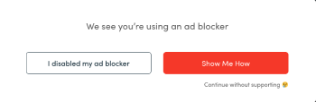
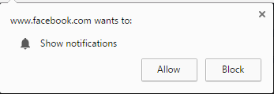
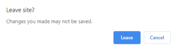
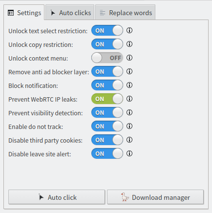
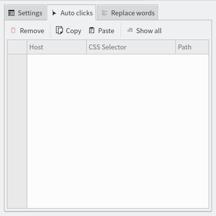
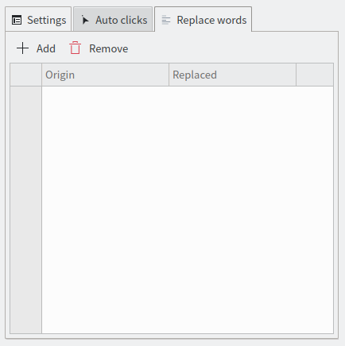
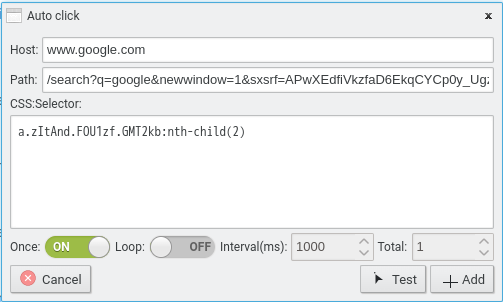
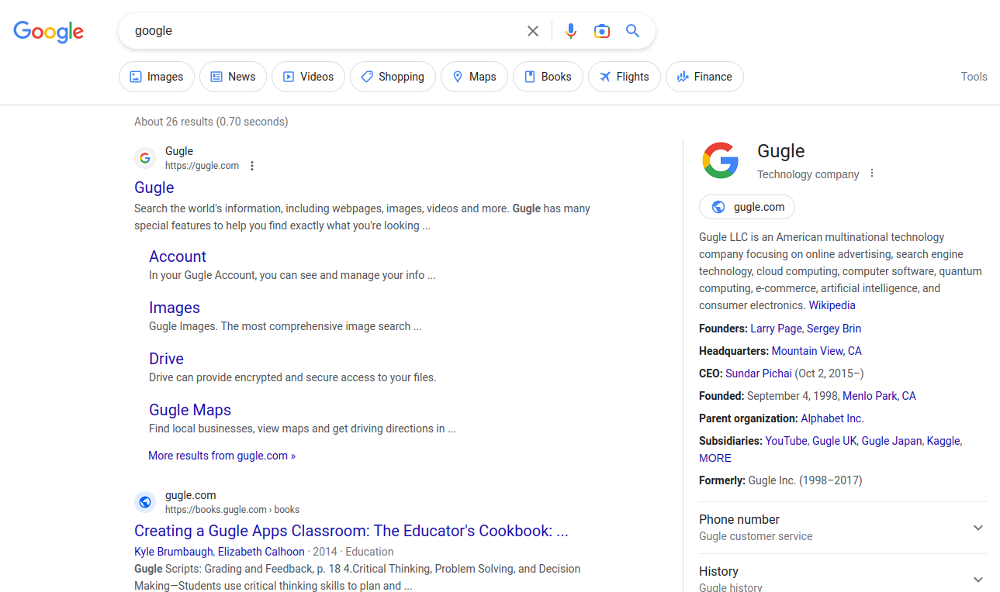

[Englisch](./README.md)\|[Vereinfachtes Chinesisch](./README.zh-CN.md)\|[traditionelles Chinesisch](./README.zh-TW.md)\|[Koreanisch](./README.ko.md)\|[Nö](./README.hi.md)\|[Arabisch](./README.ar.md)\|[Französisch](./README.fr.md)\|[Russisch](./README.ru.md)\|[Latein](./README.la.md)\|[japanisch](./README.ja.md)\|[Italienisch](./README.it.md)\|[Deutsch](./README.de.md)\|[Spanisch](./README.es.md)\|[Schwedisch](./README.sv.md)

# WebOptimizer

WebOptimizer-Browsererweiterung.

Entsperren Sie Einschränkungen, schützen Sie Ihre Privatsphäre, entfernen Sie störende Elemente, automatische Klicks und ersetzen Sie unerwünschte Wörter.

# Webshop

### Feuerfuchs:

<https://addons.mozilla.org/addon/weboptimizer/>

### Chrom:

<https://chrome.google.com/webstore/detail/web-optimizer/cnhiehgbljjkkiibdfochmcffldemhph>

### Rand:

<https://microsoftedge.microsoft.com/addons/detail/web-optimizer/nidnebakmpakkpeolmfdfhdilpogjoim>

# Merkmale

#### Klicken Sie automatisch auf Elemente von Webseiten

(wie Expander, schließen .....)

#### Ersetzen Sie unerwünschte Wörter von Webseiten

#### Entsperren Sie die Textauswahlbeschränkung

#### Kopierbeschränkung entsperren

#### Kontextmenü entsperren

#### Entfernen Sie die Anti-Werbeblocker-Schicht

#### Benachrichtigung blockieren

#### Verhindern Sie WebRTC-IP-Lecks

(WebRTC wird Ihre echte IP-Adresse preisgeben, selbst wenn Sie einen Proxy oder VPN verwenden.)

#### Sichtbarkeitserkennung verhindern

(Websites können Ihre Sichtbarkeit verfolgen. Sie können Sie beispielsweise dazu bringen, 60 Sekunden lang Werbung anzusehen, bevor Sie das Video ansehen können. Wenn Sie Ihren Browser minimieren oder zu einem anderen Tab wechseln, kann die Website dies erkennen und den Countdown anhalten. ( Diese Feature-Wahrscheinlichkeit wird nicht funktionieren.))

#### Nicht verfolgen aktivieren

(Sagen Sie Websites, Sie nicht zu verfolgen. (Das kann es immer noch))

#### Cookies von Drittanbietern deaktivieren

(Ein Drittanbieter-Cookie wird von jemand anderem als dem Eigentümer (einem Drittanbieter) auf einer Website platziert und sammelt Benutzerdaten für den Drittanbieter. Wie bei Standard-Cookies werden Drittanbieter-Cookies platziert, damit sich eine Website an etwas erinnern kann den Benutzer zu einem späteren Zeitpunkt. Cookies von Drittanbietern werden jedoch häufig von Werbenetzwerken gesetzt, die eine Website abonnieren kann, in der Hoffnung, den Umsatz oder die Seitenaufrufe zu steigern.)

#### Deaktivieren Sie die Warnung zum Verlassen der Website

# Screenshots

# Sprachen

| Sprache                  | @                                      |
| :----------------------- | :------------------------------------- |
| Englisch                 | [@filecxx](https://github.com/filecxx) |
| Vereinfachtes Chinesisch | [@filecxx](https://github.com/filecxx) |
| japanisch                | [@filecxx](https://github.com/filecxx) |
| Koreanisch               | [@filecxx](https://github.com/filecxx) |
| Deutsch                  | [@filecxx](https://github.com/filecxx) |
| Spanisch                 | [@filecxx](https://github.com/filecxx) |
| Französisch              | [@filecxx](https://github.com/filecxx) |
| Russisch                 | [@filecxx](https://github.com/filecxx) |

Sprachdateien:<https://github.com/filecxx/WebOptimizer/tree/master/chrome/_locales>

# Funktionsanfrage && Beitrag

Es ist nicht erforderlich, basierend auf diesem Projekt eine neue Browsererweiterung zu erstellen.

Wenn Sie eine Funktionsanfrage haben, posten Sie einfach ein Problem.

Darüber hinaus können Sie Ihren Code in dieses Repository verschieben, und er wird in den Hauptzweig zusammengeführt.
