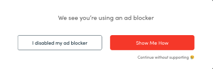
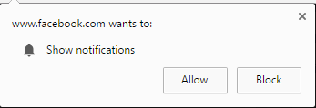
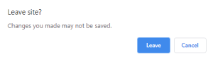
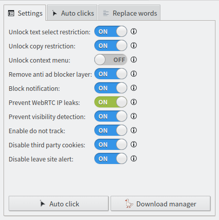
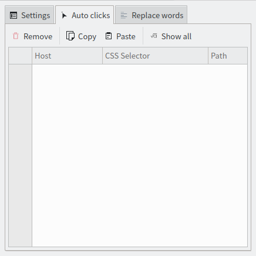
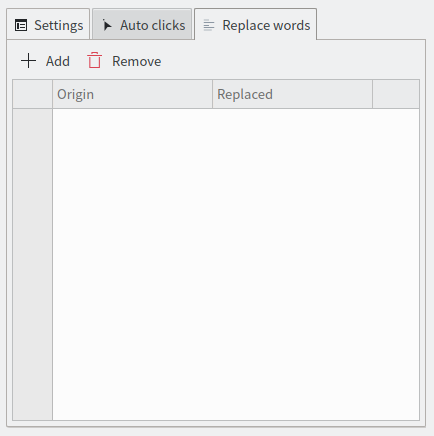
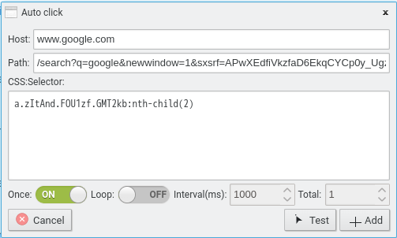
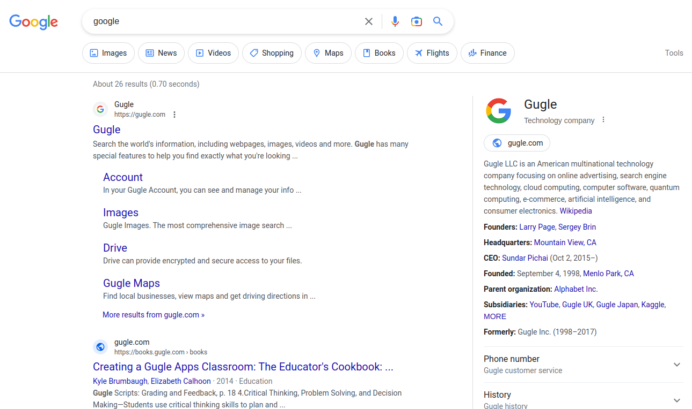

[Anglais](./README.md)\|[Chinois simplifié](./README.zh-CN.md)\|[chinois traditionnel](./README.zh-TW.md)\|[coréen](./README.ko.md)\|[Non](./README.hi.md)\|[arabe](./README.ar.md)\|[Français](./README.fr.md)\|[russe](./README.ru.md)\|[Latin](./README.la.md)\|[Japonais](./README.ja.md)\|[italien](./README.it.md)\|[Allemand](./README.de.md)\|[Español](./README.es.md)\|[suédois](./README.sv.md)

# WebOptimiseur

Extension de navigateur WebOptimizer.

Débloquez les restrictions, protégez votre vie privée, supprimez les éléments gênants, les clics automatiques et remplacez les mots que vous n'aimez pas.

# Magasin en ligne

### Firefox :

<https://addons.mozilla.org/addon/weboptimizer/>

### Chrome:

<https://chrome.google.com/webstore/detail/web-optimizer/cnhiehgbljjkkiibdfochmcffldemhph>

### Bord:

<https://microsoftedge.microsoft.com/addons/detail/web-optimizer/nidnebakmpakkpeolmfdfhdilpogjoim>

# Caractéristiques

#### Clic automatique sur les éléments des pages Web

(Comme un extenseur, fermez .....)

#### Remplacer les mots détestés des pages Web

#### Déverrouiller la restriction de sélection de texte

#### Déverrouiller la restriction de copie

#### Déverrouiller le menu contextuel

#### Supprimer la couche anti-bloqueur de publicité

#### Bloquer les notifications

#### Prévenir les fuites IP WebRTC

(WebRTC divulguera votre véritable adresse IP même si vous utilisez un proxy ou un VPN.)

#### Empêcher la détection de visibilité

(Les sites Web peuvent suivre votre visibilité. Par exemple, ils peuvent vous faire regarder des publicités pendant 60 secondes avant de vous autoriser à visionner la vidéo. Si vous réduisez votre navigateur ou passez à un autre onglet, le site Web peut le détecter et suspendre le compte à rebours. ( Cette probabilité de fonctionnalité ne fonctionnera pas.))

#### Activer Ne pas suivre

(Dites aux sites Web de ne pas vous suivre. (C'est toujours possible))

#### Désactiver les cookies tiers

(Un cookie tiers est placé sur un site Web par une personne autre que le propriétaire (un tiers) et collecte des données utilisateur pour le tiers. Comme pour les cookies standard, les cookies tiers sont placés afin qu'un site puisse se souvenir de quelque chose sur l'utilisateur ultérieurement. Les cookies tiers, cependant, sont souvent définis par des réseaux publicitaires auxquels un site peut s'abonner dans l'espoir d'augmenter les ventes ou les visites de pages.)

#### Désactiver l'alerte de sortie du site

# Captures d'écran

# Langues

| Langue            | @                                      |
| :---------------- | :------------------------------------- |
| Anglais           | [@filecxx](https://github.com/filecxx) |
| Chinois simplifié | [@filecxx](https://github.com/filecxx) |
| Japonais          | [@filecxx](https://github.com/filecxx) |
| coréen            | [@filecxx](https://github.com/filecxx) |
| Allemand          | [@filecxx](https://github.com/filecxx) |
| Espagnol          | [@filecxx](https://github.com/filecxx) |
| Français          | [@filecxx](https://github.com/filecxx) |
| russe             | [@filecxx](https://github.com/filecxx) |

Fichiers de langue :<https://github.com/filecxx/WebOptimizer/tree/master/chrome/_locales>

# Demande de fonctionnalité && Contribution

Il n'est pas nécessaire de créer une nouvelle extension de navigateur basée sur ce projet.

Si vous avez une demande de fonctionnalité, publiez simplement un problème.

De plus, vous pouvez transférer votre code dans ce référentiel et il sera fusionné dans la branche principale.
