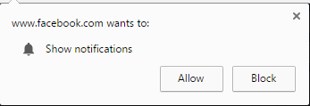
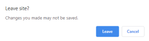

# Optimiseur Web

Extension de navigateur WebOptimizer.

Déverrouillez les restrictions, protégez votre vie privée, supprimez les éléments gênants, cliquez automatiquement et remplacez les mots que vous n'aimez pas.

# Magasin en ligne

### Firefox :

<https://addons.mozilla.org/addon/weboptimizer/>

### Chrome:

<https://chrome.google.com/webstore/detail/web-optimizer/cnhiehgbljjkkiibdfochmcffldemhph>

###  Edge:

<https://microsoftedge.microsoft.com/addons/detail/web-optimizer/nidnebakmpakkpeolmfdfhdilpogjoim>

# Caractéristiques

#### Auto click elements from web pages

(Comme expander, fermer .....)

#### Remplacer les mots détestés des pages Web

#### Déverrouiller la restriction de sélection de texte

#### Déverrouiller la restriction de copie

#### Déverrouiller le menu contextuel

#### Supprimer la couche anti-blocage des publicités

#### Notification de blocage

#### Prévenir les fuites IP WebRTC

(WebRTC divulguera votre véritable adresse IP même si vous utilisez un proxy ou un VPN.)

#### Empêcher la détection de visibilité

(Les sites Web peuvent suivre votre visibilité. Par exemple, ils peuvent vous faire regarder des publicités pendant 60 secondes avant de vous permettre de visionner la vidéo. Si vous réduisez votre navigateur ou passez à un autre onglet, le site Web peut le détecter et mettre le compte à rebours en pause. ( Cette probabilité de fonctionnalité ne fonctionnera pas.))

#### Activer ne pas suivre

(Dites aux sites Web de ne pas vous suivre. (c'est toujours possible))

#### Désactiver les cookies tiers

(Un cookie tiers est placé sur un site Web par quelqu'un d'autre que le propriétaire (un tiers) et collecte des données d'utilisateur pour le tiers. Comme pour les cookies standard, les cookies tiers sont placés afin qu'un site puisse se souvenir de quelque chose à propos de Les cookies tiers, cependant, sont souvent définis par des réseaux publicitaires auxquels un site peut s'abonner dans l'espoir d'augmenter les ventes ou les consultations de pages.)

#### Désactiver l'alerte de site de congé

# Captures d'écran

# Langues

| Langue            | @                                      |
| :---------------- | :------------------------------------- |
| Anglais           | [@filecxx](https://github.com/filecxx) |
| Chinois simplifié | [@filecxx](https://github.com/filecxx) |
| Japonais          | [@filecxx](https://github.com/filecxx) |
| coréen            | [@filecxx](https://github.com/filecxx) |
| Allemand          | [@filecxx](https://github.com/filecxx) |
| Espagnol          | [@filecxx](https://github.com/filecxx) |
| Français          | [@filecxx](https://github.com/filecxx) |
| russe             | [@filecxx](https://github.com/filecxx) |

Fichiers de langue :<https://github.com/filecxx/WebOptimizer/tree/master/chrome/_locales>

# Demande de fonctionnalité && Contribution

Il n'est pas nécessaire de créer une nouvelle extension de navigateur basée sur ce projet.

Si vous avez une demande de fonctionnalité, postez simplement un problème.

De plus, vous pouvez pousser votre code dans ce référentiel, et il sera fusionné dans la branche principale.
