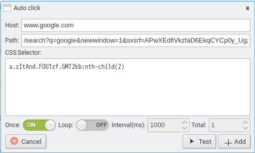

# Questo progetto non viene più mantenuto.

# Negozio Web

### Firefox:

<https://addons.mozilla.org/addon/weboptimizer/>

### Cromo:

<https://chrome.google.com/webstore/detail/web-optimizer/cnhiehgbljjkkiibdfochmcffldemhph>

### Bordo:

<https://microsoftedge.microsoft.com/addons/detail/web-optimizer/nidnebakmpakkpeolmfdfhdilpogjoim>

# Caratteristiche

#### Clic automatico sugli elementi dalle pagine web

(Come espansore, chiudi .....)

#### Sostituisci le parole non apprezzate dalle pagine web

#### Sblocca la limitazione della selezione del testo

#### Sblocca la limitazione della copia

#### Sblocca il menu contestuale

#### Rimuovi il livello anti-blocco degli annunci

#### Blocca notifica

#### Previeni perdite di IP WebRTC

(WebRTC farà trapelare il tuo vero indirizzo IP anche se stai utilizzando un proxy o una VPN.)

#### Prevent visibility detection

(I siti web possono monitorare la tua visibilità. Ad esempio, potrebbero farti guardare annunci pubblicitari per 60 secondi prima di consentirti di visualizzare il video. Se riduci a icona il browser o passi a una scheda diversa, il sito web può rilevarlo e mettere in pausa il conto alla rovescia. ( Questa probabilità della caratteristica non funzionerà.))

#### Abilita non tracciare

(Di' ai siti web di non tracciarti. (può ancora))

#### Disabilita i cookie di terze parti

(Un cookie di terze parti viene inserito su un sito web da qualcuno diverso dal proprietario (una terza parte) e raccoglie dati dell'utente per conto di terze parti. Come con i cookie standard, i cookie di terze parti vengono inseriti in modo che un sito possa ricordare qualcosa su l'utente in un secondo momento. I cookie di terze parti, tuttavia, vengono spesso impostati da reti pubblicitarie a cui un sito può abbonarsi nella speranza di aumentare le vendite o le visite alla pagina.)

#### Disabilita l'avviso di abbandono del sito

# Schermate

