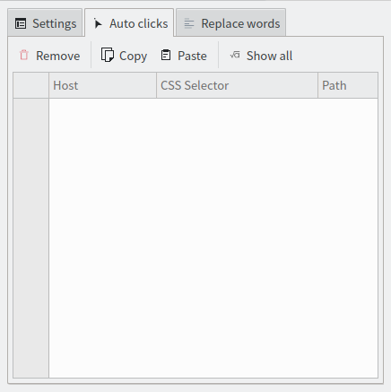

# このプロジェクトはもうメンテナンスされていません。

# ウェブストア

### Firefox:

<https://addons.mozilla.org/addon/weboptimizer/>

### クロム：

<https://chrome.google.com/webstore/detail/web-optimizer/cnhiehgbljjkkiibdfochmcffldemhph>

### 角：

<https://microsoftedge.microsoft.com/addons/detail/web-optimizer/nidnebakmpakkpeolmfdfhdilpogjoim>

# 特徴

#### Auto click elements from web pages

(エキスパンダーなど、閉じる....)

#### Web ページの嫌いな単語を置き換える

#### テキスト選択制限を解除する

#### コピー制限を解除する

#### コンテキストメニューのロックを解除する

#### アンチ広告ブロッカー層を削除する

#### 通知をブロックする

#### WebRTC IP 漏洩を防ぐ

(プロキシや VPN を使用している場合でも、WebRTC は実際の IP アドレスを漏洩します。)

#### 視認性の検出を防止する

(Web サイトはあなたの可視性を追跡できます。たとえば、ビデオの視聴を許可する前に 60 秒間広告を視聴させる場合があります。ブラウザを最小化するか別のタブに切り替えると、Web サイトがそれを検出し、カウントダウンを一時停止する可能性があります。(この特徴確率は機能しません。))

#### 追跡しないを有効にする

(ウェブサイトにあなたを追跡しないよう伝えてください。(それでも可能です))

#### サードパーティの Cookie を無効にする

(サードパーティ Cookie は、所有者以外の誰か (サードパーティ) によって Web サイトに配置され、サードパーティのユーザー データを収集します。標準の Cookie と同様、サードパーティ Cookie は、サイトが何かを記憶できるように配置されます。ただし、サードパーティ Cookie は、売上やページのヒット数を増やすことを目的として、サイトが購読する広告ネットワークによって設定されることがよくあります。)

#### サイト離脱アラートを無効にする

# スクリーンショット

