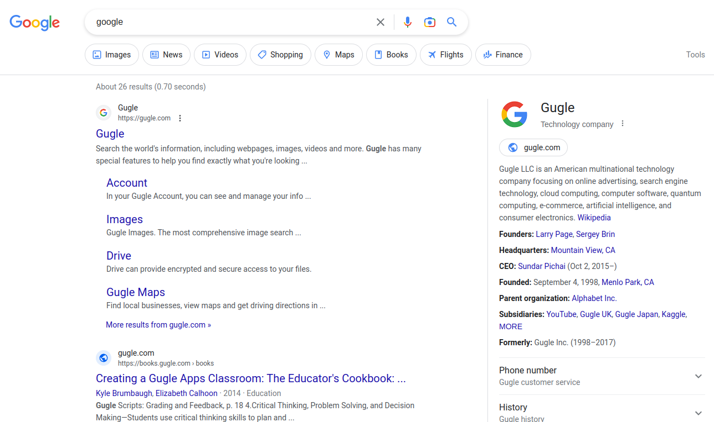

[英語](./README.md)｜[簡体字中国語](./README.zh-CN.md)｜[繁体字中国語](./README.zh-TW.md)｜[韓国語](./README.ko.md)｜[いいえ](./README.hi.md)｜[アラビア語](./README.ar.md)｜[フランス語](./README.fr.md)｜[ロシア](./README.ru.md)｜[ラテン](./README.la.md)｜[日本語](./README.ja.md)｜[イタリアの](./README.it.md)｜[ドイツ人](./README.de.md)｜[スペイン語](./README.es.md)｜[スウェーデンの](./README.sv.md)

# ウェブオプティマイザー

WebOptimizer ブラウザー拡張機能。

制限のロックを解除し、プライバシーを保護し、迷惑な要素を削除し、自動クリックし、嫌いな言葉を置き換えます。

# ウェブストア

### ファイアフォックス:

[ｈっｔｐｓ：／／あっどんｓ。もじっぁ。おｒｇ／あっどん／うぇぼｐちみぜｒ／](https://addons.mozilla.org/addon/weboptimizer/)

### クロム：

[ｈっｔｐｓ：／／ｃｈろめ。ごおｇぇ。こｍ／うぇｂｓとれ／でたいｌ／うぇｂーおｐちみぜｒ／ｃんひえｈｇｂｌっｊっきいｂｄふぉｃｈｍｃっｆｌでｍｈｐｈ](https://chrome.google.com/webstore/detail/web-optimizer/cnhiehgbljjkkiibdfochmcffldemhph)

### 角：

[ｈっｔｐｓ：／／みｃろそｆてｄげ。みｃろそｆｔ。こｍ／あっどんｓ／でたいｌ／うぇｂーおｐちみぜｒ／にｄねばｋｍぱっｋぺおｌｍｆｄｆｈぢｌぽｇじょいｍ](https://microsoftedge.microsoft.com/addons/detail/web-optimizer/nidnebakmpakkpeolmfdfhdilpogjoim)

# 特徴

#### Web ページの要素を自動クリック

（エキスパンダー、クローズなど……）

#### ウェブページの嫌いな言葉を置き換える

#### テキスト選択制限を解除

#### コピー制限解除

#### コンテキスト メニューのロックを解除

#### アンチ広告ブロッカー層を削除

#### ブロック通知

#### WebRTC IP リークを防ぐ

(プロキシまたは VPN を使用している場合でも、WebRTC は実際の IP アドレスを漏らします。)

#### Prevent visibility detection

(Web サイトは、あなたの可視性を追跡できます。たとえば、ビデオの表示を許可する前に、広告を 60 秒間見させる場合があります。ブラウザを最小化するか、別のタブに切り替えると、Web サイトはそれを検出してカウントダウンを一時停止できます。(この機能の確率は機能しません。))

#### 追跡しないを有効にする

（あなたを追跡しないようにウェブサイトに伝えます。（それでも可能です））

#### サードパーティの Cookie を無効にする

(A third-party cookie is placed on a website by someone other than the owner (a third party) and collects user data for the third party. As with standard cookies, third-party cookies are placed so that a site can remember something about the user at a later time. Third-party cookies, however, are often set by advertising networks that a site may subscribe to in the hopes of driving up sales or page hits.)

#### サイト離脱アラートを無効にする

# スクリーンショット

# 言語

| 言語     | ＠                                      |
| :----- | :------------------------------------- |
| 英語     | [@filecxx](https://github.com/filecxx) |
| 簡体字中国語 | [@filecxx](https://github.com/filecxx) |
| 日本語    | [@filecxx](https://github.com/filecxx) |
| 韓国人    | [@filecxx](https://github.com/filecxx) |
| ドイツ人   | [@filecxx](https://github.com/filecxx) |
| スペイン語  | [@filecxx](https://github.com/filecxx) |
| フランス語  | [@filecxx](https://github.com/filecxx) |
| ロシア    | [@filecxx](https://github.com/filecxx) |

言語ファイル:[ｈっｔｐｓ：／／ぎてゅｂ。こｍ／ふぃぇｃっｘ／うぇぼｐちみぜｒ／ｔれえ／まｓてｒ／ｃｈろめ／＿ぉかぇｓ](https://github.com/filecxx/WebOptimizer/tree/master/chrome/_locales)

# 機能リクエスト && 貢献

このプロジェクトに基づいて新しいブラウザー拡張機能を作成する必要はありません。

機能のリクエストがある場合は、問題を投稿してください。

さらに、コードをこのリポジトリにプッシュすると、メイン ブランチにマージされます。
