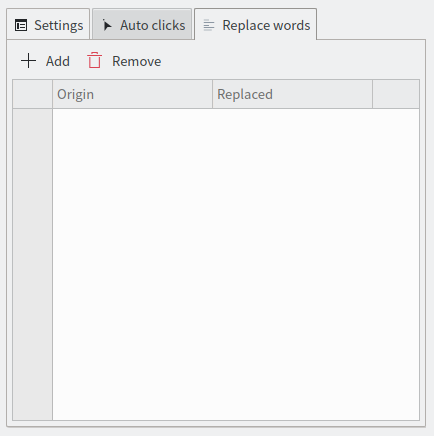

[영어](./README.md)\|[중국어 간체](./README.zh-CN.md)\|[중국어 번체](./README.zh-TW.md)\|[한국어](./README.ko.md)\|[아니요](./README.hi.md)\|[아라비아 말](./README.ar.md)\|[프랑스 국민](./README.fr.md)\|[러시아인](./README.ru.md)\|[라틴어](./README.la.md)\|[일본어](./README.ja.md)\|[이탈리아 사람](./README.it.md)\|[독일 사람](./README.de.md)\|[스페인의](./README.es.md)\|[스웨덴어](./README.sv.md)

# 웹최적화기

WebOptimizer 브라우저 확장.

제한을 해제하고, 개인 정보를 보호하고, 성가신 요소를 제거하고, 자동 클릭하고, 싫어하는 단어를 바꾸십시오.

# 웹 스토어

### 파이어폭스:

<https://addons.mozilla.org/addon/weboptimizer/>

### 크롬:

<https://chrome.google.com/webstore/detail/web-optimizer/cnhiehgbljjkkiibdfochmcffldemhph>

### 가장자리:

<https://microsoftedge.microsoft.com/addons/detail/web-optimizer/nidnebakmpakkpeolmfdfhdilpogjoim>

# 특징

#### 웹 페이지에서 자동 클릭 요소

(확장기 등 닫기 .....)

#### 웹 페이지에서 싫어하는 단어 바꾸기

#### 텍스트 선택 제한 해제

#### 복사 제한 해제

#### 상황에 맞는 메뉴 잠금 해제

#### 안티 광고 차단 레이어 제거

#### 알림 차단

#### WebRTC IP 유출 방지

(WebRTC는 프록시 또는 VPN을 사용하는 경우에도 실제 IP 주소를 유출합니다.)

#### 가시성 감지 방지

(웹사이트는 가시성을 추적할 수 있습니다. 예를 들어 동영상을 보기 전에 60초 동안 광고를 보도록 할 수 있습니다. 브라우저를 최소화하거나 다른 탭으로 전환하면 웹사이트에서 이를 감지하고 카운트다운을 일시 중지할 수 있습니다. ( 이 기능 확률은 작동하지 않습니다.))

#### 추적 안함 활성화

(웹사이트에 당신을 추적하지 말라고 말하세요. (여전히 가능합니다))

#### 외부 쿠키를 사용하지 않음

(제3자 쿠키는 소유자(제3자)가 아닌 다른 사람이 웹 사이트에 배치하고 제3자를 위해 사용자 데이터를 수집합니다. 그러나 제3자 쿠키는 판매 또는 페이지 방문 횟수를 늘리기 위해 사이트가 구독할 수 있는 광고 네트워크에서 설정하는 경우가 많습니다.)

#### 사이트 이탈 경고 비활성화

# 스크린샷

# 언어

| 언어     | @                                      |
| :----- | :------------------------------------- |
| 영어     | [@filecxx](https://github.com/filecxx) |
| 중국어 간체 | [@filecxx](https://github.com/filecxx) |
| 일본어    | [@filecxx](https://github.com/filecxx) |
| 한국인    | [@filecxx](https://github.com/filecxx) |
| 독일 사람  | [@filecxx](https://github.com/filecxx) |
| 스페인의   | [@filecxx](https://github.com/filecxx) |
| 프랑스 국민 | [@filecxx](https://github.com/filecxx) |
| 러시아인   | [@filecxx](https://github.com/filecxx) |

언어 파일:<https://github.com/filecxx/WebOptimizer/tree/master/chrome/_locales>

# 기능 요청 및 기여

이 프로젝트를 기반으로 새 브라우저 확장을 만들 필요가 없습니다.

기능 요청이 있는 경우 문제를 게시하기만 하면 됩니다.

또한 이 리포지토리에 코드를 푸시할 수 있으며 메인 브랜치에 병합됩니다.
